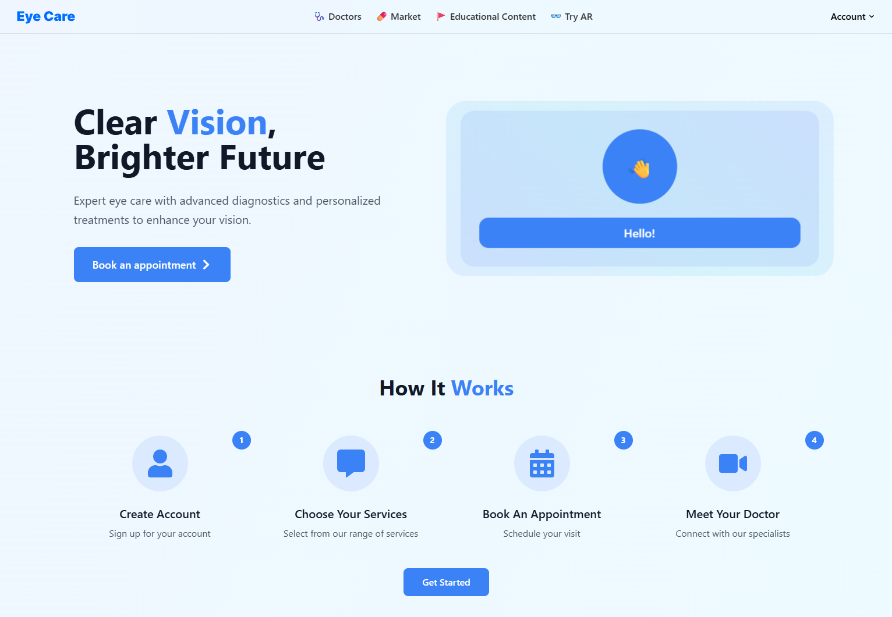
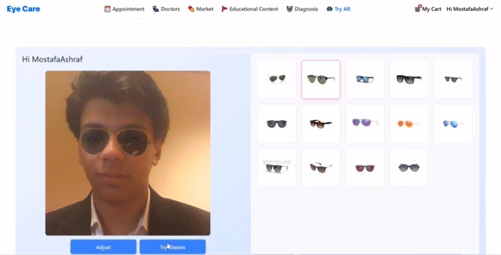
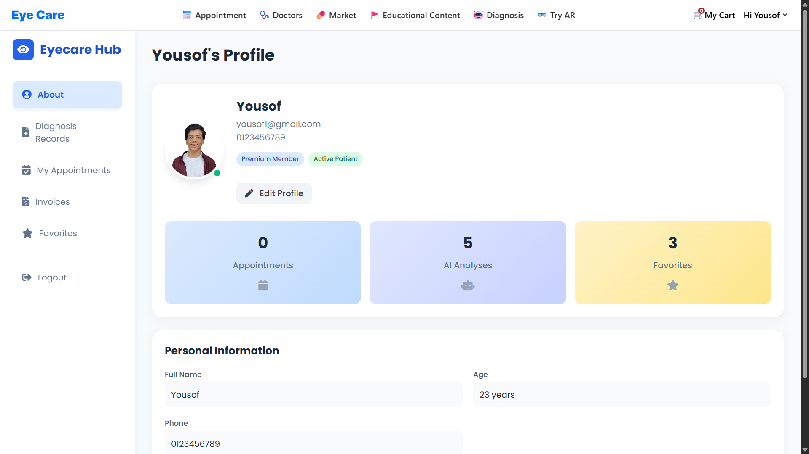
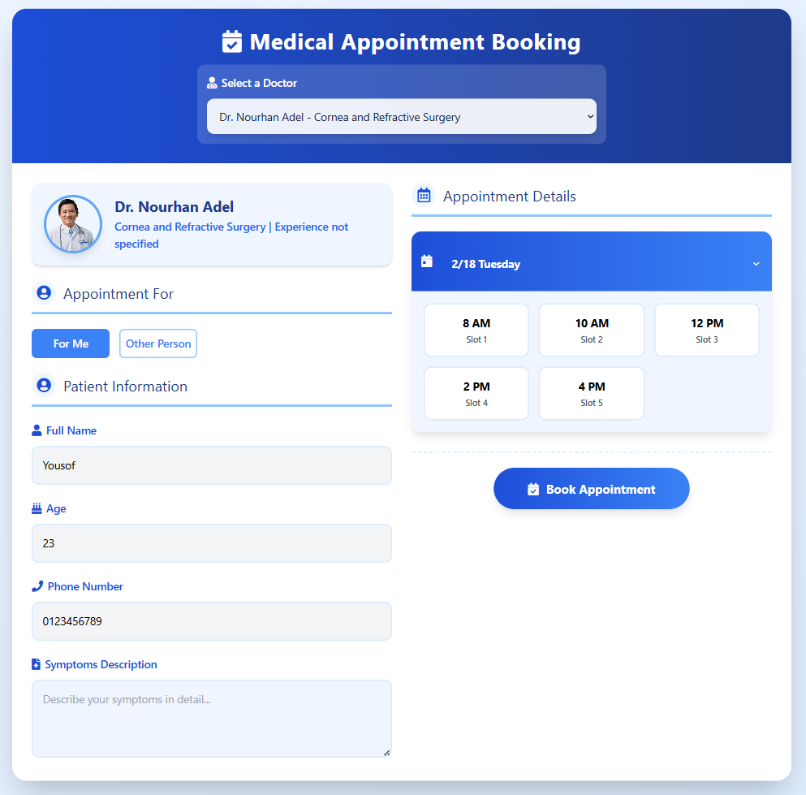
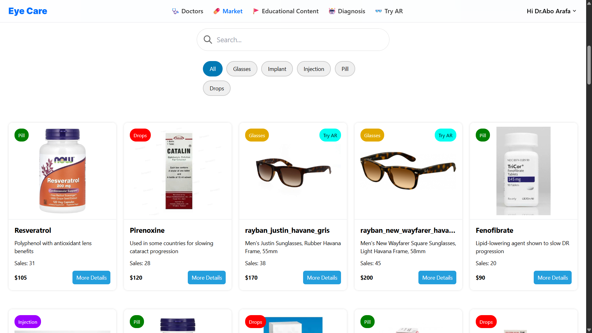

# 👁️ Eye Care Hub – Front-End (Graduation Project)

This repository contains the front-end code for **Eye Care Hub**, a full-stack medical and e-commerce platform built as a graduation project at the Faculty of Computers and Artificial Intelligence, Benha University (2025).

> ⚠️ This repo includes only the **React.js front-end**. The .NET back-end, AI models, and Flutter mobile app are maintained by other teams and not included here.

---

## 🚀 Project Overview

Eye Care Hub is a modern web platform designed to improve access to eye care services through technology. It includes:

- 🧑‍⚕️ Multi-role system for **clients**, **doctors**, and **admins**
- 📆 Appointment booking & profile management
- 🛒 **E-commerce module** for medicines and glasses
- 👓 **Live virtual try-on** for eyeglasses via webcam
- 🧠 Integration with AI models to analyze eye X-rays for medical diagnosis
- 📱 Mobile app (built with Flutter by the mobile team)

---

## 💻 Technologies Used

- **React.js**
- **Redux Toolkit**
- **React Router DOM**
- **Tailwind CSS**
- **React Query**
- **Formik + Yup**
- **React Icons**
- **Git & GitHub**

---

## 🔧 Features Implemented in Front-End

- 🔐 Role-based access control (client / Doctor / Admin)
- 🧾 Registration & Login (Form validation with Formik + Yup)
- 👨‍⚕️ Doctor profile, posts, reviews, and appointment system
- 🛍️ E-commerce section: product listing, cart, checkout
- 📷 Live glasses try-on using webcam
- 🧠 X-ray upload & AI result display (connected to back-end models)
- 🌐 Responsive design using Tailwind CSS
- ⚙️ Modular, reusable components & optimized API calls with React Query

---

## 🗂️ Folder Structure

- /src
- /assets → Images
- /components → Reusable UI components
- /hooks → Reusable custom hooks
- /pages → Role-based pages (doctor, client, admin)
- /redux → Redux store & setup, slices, React Query config & API functions
- /routes → Protected routes

---

## 🧪 Setup Instructions

1. **Clone the repository**

```bash
git clone https://github.com/Yousof27/Graduation-Project.git
cd Graduation-Project

```

2. **Install dependencies**

```bash
npm install

```

3. **Run the development server**

```bash
npm run dev

```

## 📷 Screenshots

| Home Page                       | Try-On Feature                    | Dashboard                                 |
| ------------------------------- | --------------------------------- | ----------------------------------------- |
|  |  |  |

| Educational Content             | Book Appointment                  | Market                                    |
| ------------------------------- | --------------------------------- | ----------------------------------------- |
|    |   |     |

## 🤝 Team Collaboration

| Team      | Tech Stack        | Responsibilities                            |
| --------- | ----------------- | ------------------------------------------- |
| Front-End | React.js, Redux   | Web interface & user experience             |
| Back-End  | .NET              | API development & database management       |
| AI        | Python, ML models | X-ray image analysis & diagnosis prediction |
| Mobile    | Flutter           | Cross-platform mobile version               |

## 📌 Notes

- This repo is for educational and demonstration purposes.

- You’re welcome to fork, explore, and learn from the code.

- Back-end and AI models are not open-sourced due to size and university hosting limitations.

## 🔗 Contact

**Youssef Kamal**  
Front-End Developer  
[LinkedIn](https://www.linkedin.com/in/youssef-kamal-1-front-end-dev) • [GitHub](https://github.com/Yousof27)  
Email: yousofkamal24@gmail.com
